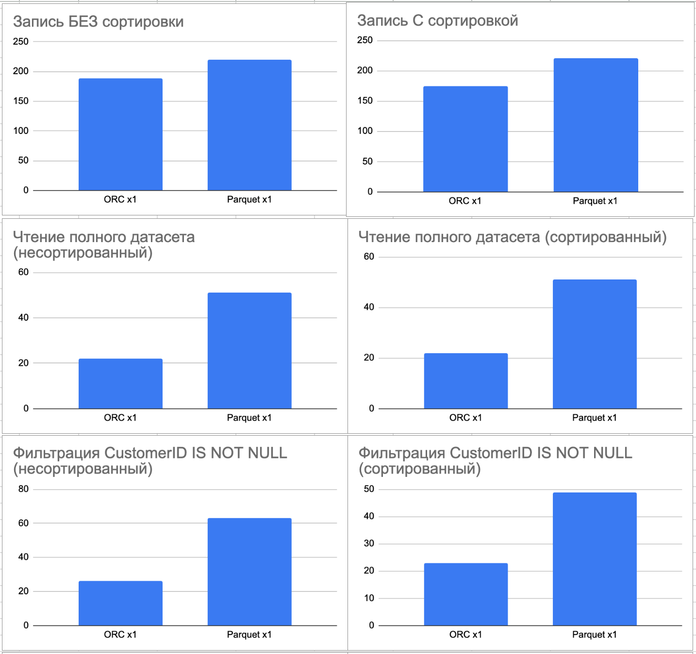
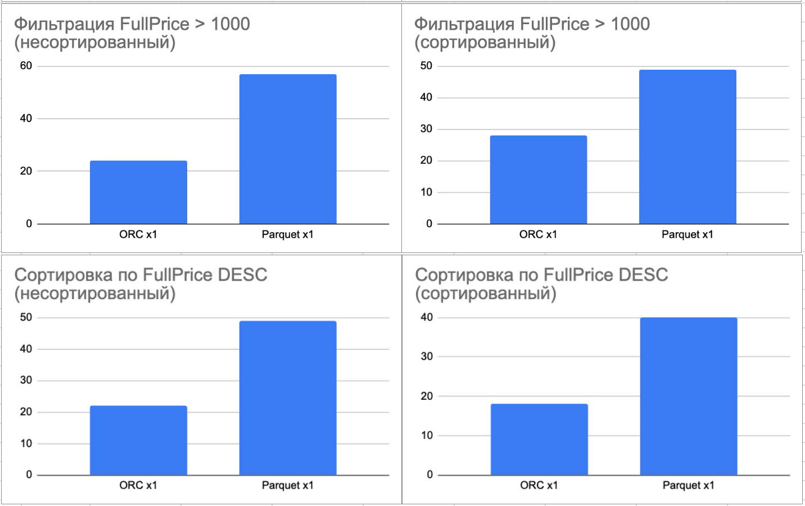

# Практическая работа № 2
## Выполнили
- Денисова Мария
- Конончук Сергей
- Полухин Максим
  
## Задание
- познакомиться с основами программирования в экосистеме Apache Spark
- разобраться в способах кодирования данных в форматах Parquet/ORC
- при помощи Apache Spark построить простой процесс преобразования сырых данных проекта "Фундаментальные основы систем обработки больших данных" в один из этих форматов (чтение - какое-либо простое произвольное преобразование - запись) и сделать оценку эффективности хранения - сколько места занимают и как быстро их можно читать

## Исходные данные
- Образ Apache Spark из Docker Hub - https://hub.docker.com/r/apache/spark
- Датасет - E-Commerce Data - https://www.kaggle.com/datasets/carrie1/ecommerce-data/data
- Размер датасета - 45.58 MB

## Результаты

### Сравнительная таблица производительности ORC vs Parquet

| Операция | ORC (мс) | Parquet (мс) | ORC Размер (KB) | Parquet Размер (KB) |
|----------|----------|--------------|-----------------|---------------------|
| **Запись БЕЗ сортировки** | 188 | 219 | 60 | 70 |
| **Запись С сортировкой** | 174 | 220 | 50 | 70 |
| **Чтение полного датасета (несортированный)** | 22 | 51 | - | - |
| **Чтение полного датасета (сортированный)** | 26 | 63 | - | - |
| **Фильтрация CustomerID IS NOT NULL (несортированный)** | 23 | 49 | - | - |
| **Фильтрация CustomerID IS NOT NULL (сортированный)** | 24 | 57 | - | - |
| **Фильтрация FullPrice > 1000 (несортированный)** | 28 | 49 | - | - |
| **Фильтрация FullPrice > 1000 (сортированный)** | 22 | 49 | - | - |
| **Сортировка по FullPrice DESC (несортированный)** | 18 | 40 | - | - |
| **Сортировка по FullPrice DESC (сортированный)** | 17 | 43 | - | - |

*Все результаты усреднены за 20 запусков для обеспечения достоверности*

### Визуализация результатов

## Выводы

1. **Скорость чтения данных**: ORC быстрее Parquet в операциях чтения:
   - Чтение полного датасета: **ORC быстрее на 57-59%** (22-26 мс vs 51-63 мс)
   - Фильтрация: **ORC быстрее на 47-58%** (22-28 мс vs 49-57 мс)
   - Сортировка: **ORC быстрее на 55-60%** (17-18 мс vs 40-43 мс)

2. **Скорость записи данных**: ORC немного быстрее при записи:
   - Запись без сортировки: **ORC быстрее на 14%** (188 мс vs 219 мс)
   - Запись с сортировкой: **ORC быстрее на 21%** (174 мс vs 220 мс)

3. **Размер файлов**: ORC создает чуть более компактные файлы:
   - Без сортировки: **ORC меньше на 14%** (60 KB vs 70 KB)
   - С сортировкой: **ORC меньше на 29%** (50 KB vs 70 KB)

### Общий вывод:

- ✅ **Чтение данных**: ORC быстрее на 47-60% во всех операциях
- ✅ **Запись данных**: ORC быстрее на 14-21%
- ✅ **Размер файлов**: ORC создает файлы на 14-29% меньше (50-60 KB vs 70 KB)